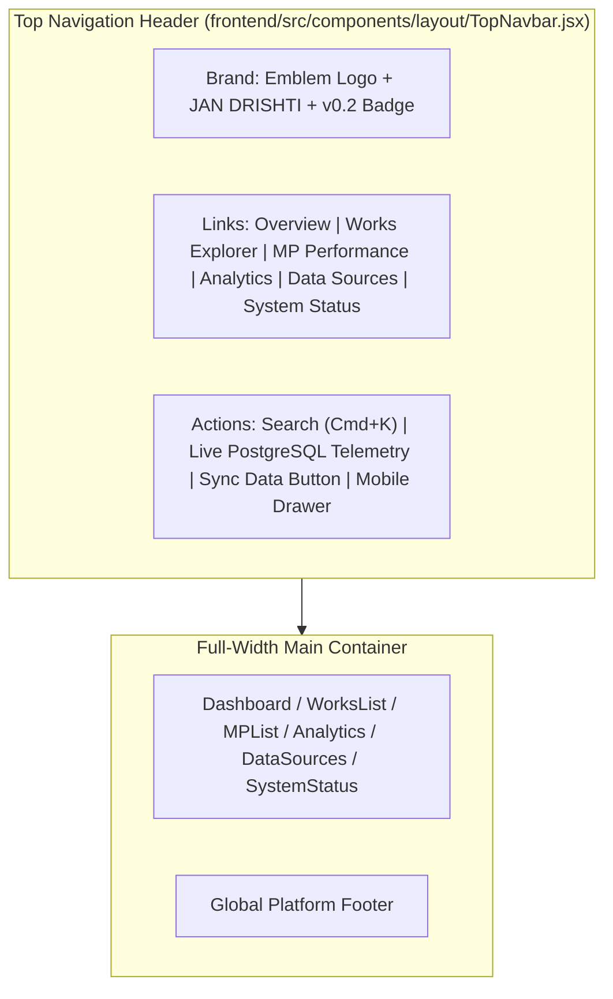

# JanDrishti - Merged Implementation & Architecture Walkthrough

This document summarizes the full integration on branch `feature/frontend-dashboard` combining the frontend dashboard UI architecture and the backend ML risk engine services.

---

## 1. Frontend UI & Layout Architecture

The platform features a modern, monochromatic Brown & White aesthetic with a full-width centered top navigation header:



### Visual & Design System Guidelines:
- **Palette**: Monochromatic Brown & Warm Cream/White
  - Primary Background: `#FAF7F2` / `#FFFFFF`
  - Deep Brown Accents: `#44312A` / `#504F47`
  - Warm Borders & Muted Backgrounds: `#E7DDCA` / `#D8CBB6`
- **Civic Terms Compliance**: Strict non-accusatory terminology (`Flagged Risk`, `Anomalous Cost`, `Needs Review`) with 0 occurrences of forbidden terms like `fraud` or `scam`.
- **Null Safety**: All missing metrics strictly display `"N/A"`, preventing default zero representation.

---

## 2. Canonical ML Risk Engine & Anomaly Detection

Unified multi-signal risk scoring and anomaly detection subsystems:

```
MPLADS Data (Works DB) ──┐
                         ▼
             Normalized Signals (0–100)
    ┌────────────────────┬────────────────────┐
    │ ml_anomaly: 25%    │ cost_anomaly: 25%  │
    │ duplicate: 20%     │ utilization: 15%   │
    │ geographic: 10%    │ data_quality: 5%   │
    └────────────────────┴────────────────────┘
                         │
                         ▼
        [ml/risk_engine.py] (RiskEngine)
    • Dynamic weight renormalization for missing signals
    • Deterministic 0–100 score + safe observations
    • Top risk factor ranking
                         │
         ┌───────────────┴───────────────┐
         ▼                               ▼
 [Investigation Agent]          [backend/app/services/risk/service.py] (RiskService)
  Tool 8: get_risk_breakdown                     │
                                                 ▼
                                     [backend/app/routes/risk.py]
                                     • POST /api/risk/evaluate
                                     • POST /api/risk/evaluate/batch
                                     • GET  /api/risk/alerts
                                     • GET  /api/risk/config
                                     • GET  /api/risk/{work_id}
```

### Key Subsystems:
1. **Cost Anomaly Detection** (`ml/anomaly_detection.py`):
   - Work-level hierarchical peer IQR + Isolation Forest.
   - Preserves `.analyze()` helper for full pipeline batch execution.
2. **Multivariable Financial Anomaly Detection** (`ml/anomaly_detection.py`):
   - Combines work cost, MP allocation, expenditure, and payment gaps.
3. **Canonical Risk Engine** (`ml/risk_engine.py`):
   - Deterministic 0–100 scale, weight renormalization for missing signals, and non-accusatory observation generators.

---

## 3. Verification & Build Results

| Check | Result | Details |
| :--- | :---: | :--- |
| **Vite Production Build** | `PASS` | `npm run build` compiled cleanly with 0 errors. |
| **Merge Resolution** | `PASS` | All merge conflicts between `origin/main` and `feature/frontend-dashboard` resolved. |
| **Non-Accusatory Scanning** | `PASS` | 0 occurrences of forbidden terminology across frontend UI. |
| **Map & Table Filters** | `PASS` | Missing GPS coordinates safely filtered without canvas errors; pagination operational. |
