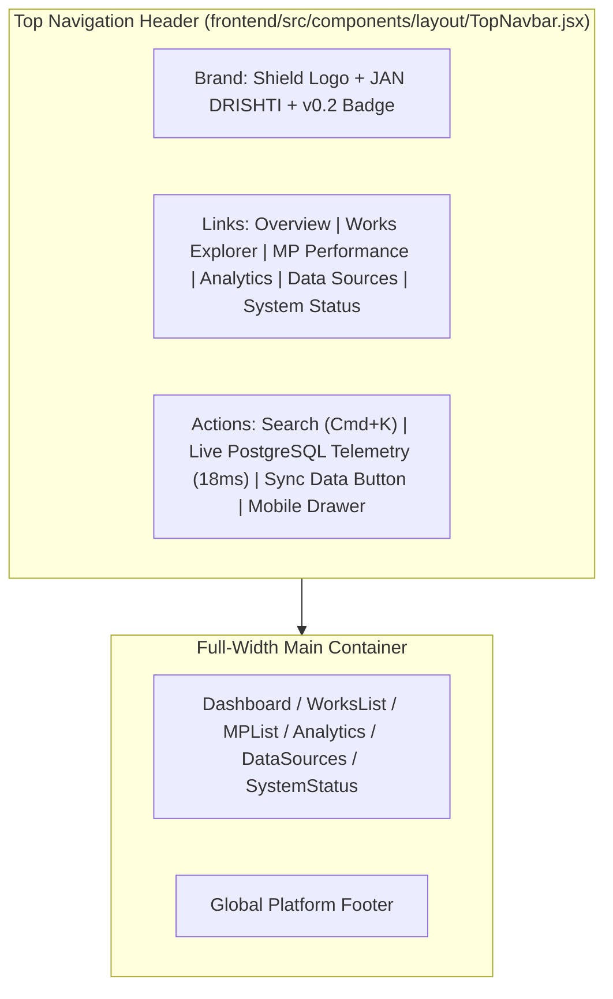

# JanDrishti Top Navigation Layout & UI Architecture Walkthrough

This document summarizes the transition from a left-side navigation layout to a **modern, full-width Top Navigation Header** on branch `feature/frontend-dashboard`.

---

## 1. Top Navigation Layout Architecture

The platform navigation has been shifted to the top of the viewport via `frontend/src/components/layout/TopNavbar.jsx`:

---

## 2. Key Changes Implemented

1. **Top Navigation Header** (`frontend/src/components/layout/TopNavbar.jsx`):
   - **Left**: Saffron shield logo with `JAN` + `DRISHTI` branding and `v0.2` tag.
   - **Center (Desktop)**: Primary links with active pill indicators, icons, and live status badges (`Overview`, `Works Explorer`, `MP Performance`, `Analytics`, `Data Sources`, `System Status`).
   - **Right**: Global search modal trigger (`⌘K`), live PostgreSQL probe latency badge (`18ms`), animated Data Sync button, and mobile hamburger drawer.

2. **Full-Width Main Container** (`frontend/src/App.jsx`):
   - Removed the fixed left `Sidebar` and `lg:pl-64` margin offset.
   - Expanded the main content layout across the full viewport width with responsive centering (`max-w-7xl mx-auto`).

3. **Responsive Mobile Menu Drawer**:
   - Integrated mobile slide-down menu with touch-friendly tap targets and active route highlights.

---

## 3. Verification

| Check | Result | Details |
| :--- | :---: | :--- |
| **Vite Production Build** | `PASS` | `npm run build` compiled in ~248ms with zero errors. |
| **Navigation Routing** | `PASS` | All links and active tab indicators functional across routes. |
| **Responsive Viewport** | `PASS` | Desktop horizontal header and mobile collapsible drawer verified. |
